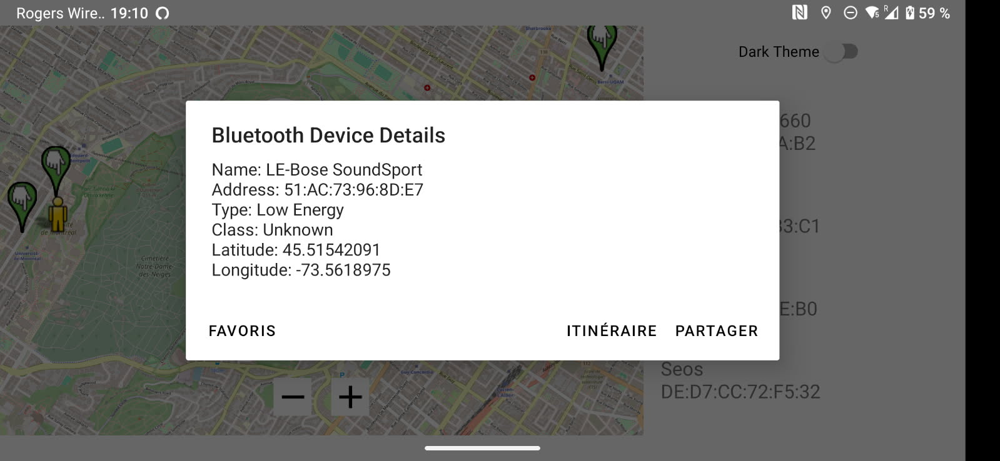

# inf8405-laboratories
Ce repository contient le travail effectué pendant les laboratoires du cours INF8405 Informatique mobile.

## TP1: Introduction à Android
Dans ce TP, nous avons découvert les bases du développement Android, y compris la création d'une interface utilisateur simple et la gestion des événements. Pour cela, nous avons créé un jeu mobile de puzzle à résoudre, avec un score et un historique des coups joués.

Les tuiles sont mobiles et gèrent les collisions entre elles. À chaque nouveau coup, le compteur monte, et lorsqu'un niveau est réussi, le nombre de coup est enregistré. On peut à tout moment revenir en arrière sur les précédents coups joués.

  

## TP2: Services et Bluetooth
Ce TP se concentre sur l'utilisation des services Android pour améliorer l'interactivité de l'application. Ainsi, nous utilisons le bluetooth ainsi que OpenStreetMap pour afficher les appareils bluetooth croisés, leurs localisation de rencontre ainsi que d'autres informations.

Sur les captures ci-dessous, on peut voir par exemple les points de rencontre des appareils sur la carte, et les informations récoltées pour un appareil en particulier.

  
  

## Projet final: Géolocalisation et Base de données
Dans ce projet final, nous avons exploré les fonctionnalités de géolocalisation et d'intégration de cartes dans une application Android, ainsi que d'authentification et de stockage d'information dans une base de données. Le projet consiste en un assistant d'enregistrement d'activité de course à pied en extérieur. Pour la carte, nous avons utilisé Google Maps avec une API KEY, et pour la base de donnéees nous avons utilisé Firebase.

Sur les captures d'écrans suivantes, on peut voir l'écran de connexion, l'écran d'enregistrement d'une activité avec les informations de course, comme la vitesse, la distance ou le temps. On peut aussi avoir une vu cartographique du déplacement avec le trajet déjà effectué. Enfin, on a une page d'historique des activités qui permet de revoir le trajet effectué.

  
  
  
  

